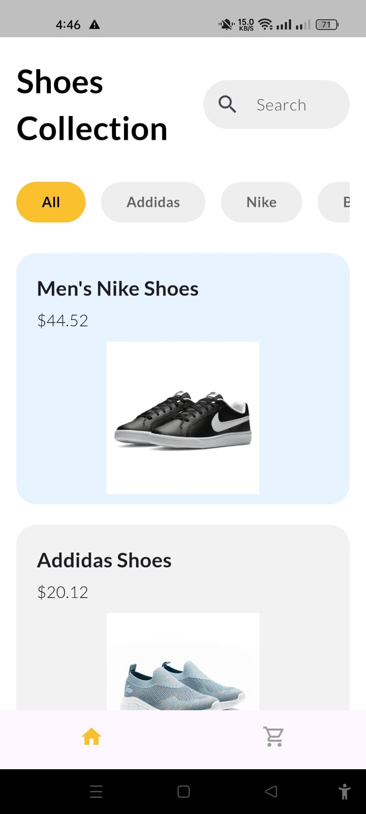
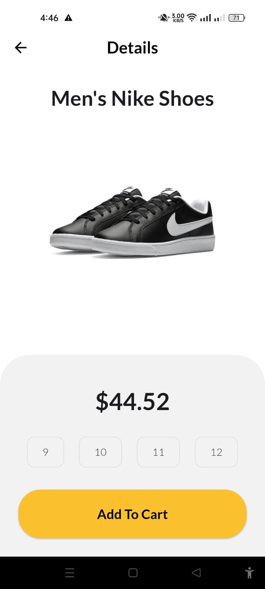
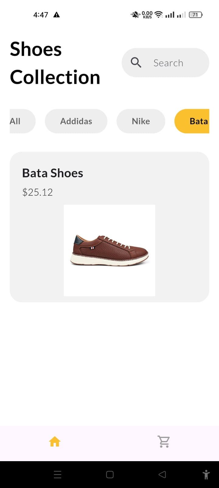
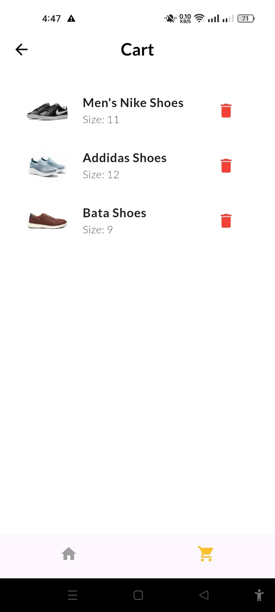

# test15_shop_2

A stylish and functional E-commerce Shop Application built with Flutter.

## 📱 App Screenshots

<p align="center">
  
  
  
  
</p>

## ✨ Features

*   **Modern UI/UX**: Clean and responsive design.
*   **Product Catalog**: Browse through various categories and products.
*   **Shopping Cart**: Easily add and manage items in your cart.
*   **Custom Fonts**: Uses Lato for a premium feel.
*   **Asset Management**: Organized images and UI components.

## 🛠️ Tech Stack

*   **Framework**: [Flutter](https://flutter.dev/)
*   **Language**: [Dart](https://dart.dev/)
*   **Design**: Material Design & Cupertino Icons
*   **Fonts**: Lato

## 🚀 Getting Started

To get a local copy up and running, follow these simple steps.

### Prerequisites

*   Flutter SDK: [Install Flutter](https://docs.flutter.dev/get-started/install)
*   Android Studio / VS Code

### Installation

1.  **Clone the repo**
    ```bash
    git clone https://github.com/your-username/test15_shop_2.git
    ```
2.  **Install dependencies**
    ```bash
    flutter pub get
    ```
3.  **Run the app**
    ```bash
    flutter run
    ```

## 📂 Project Structure

*   `lib/`: Contains the main source code.
    *   `main.dart`: Entry point of the app.
    *   `home_page.dart`: The home screen.
    *   `cart.dart`: Shopping cart logic/UI.
*   `assets/`: Images, icons, and fonts used in the project.

---
*Created with ❤️ Md. joy
